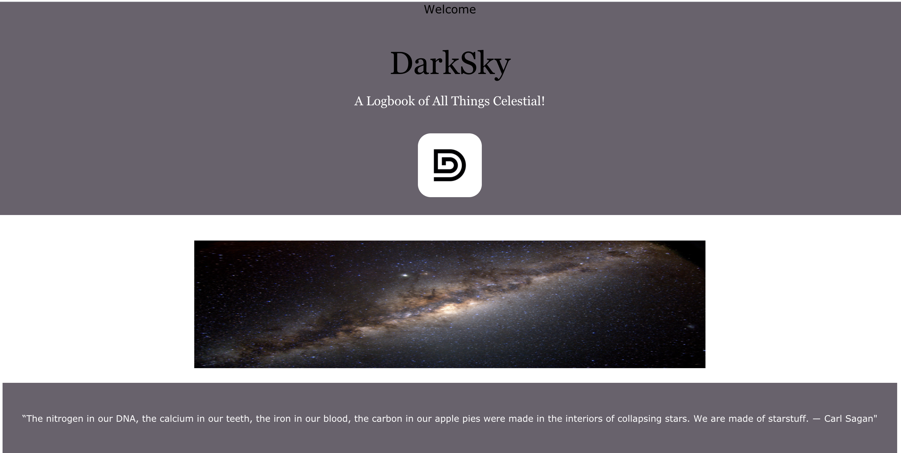
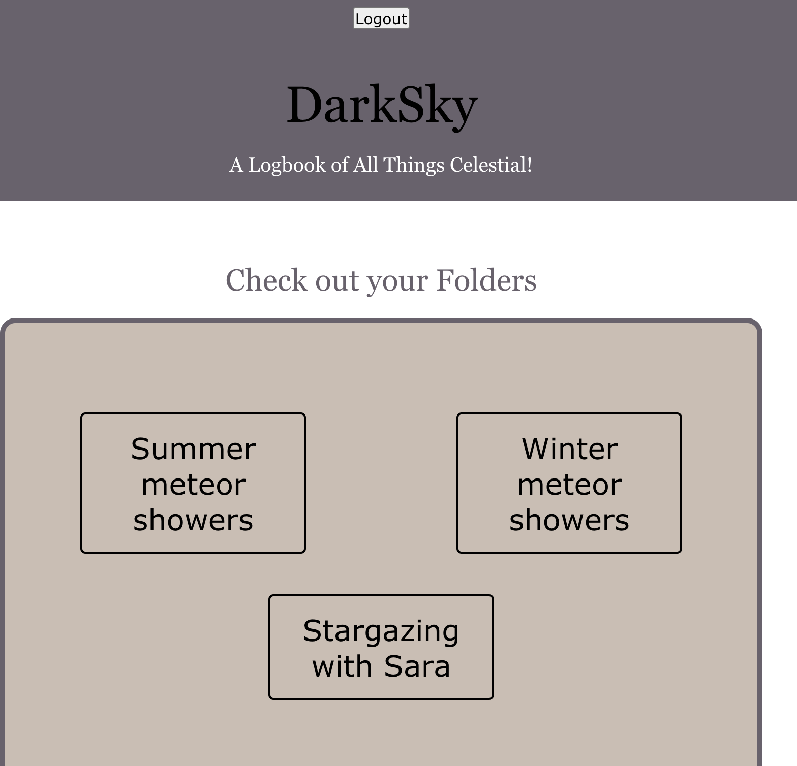
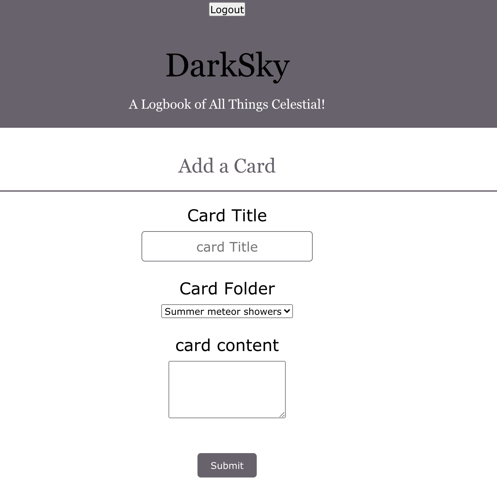

Live app: (https://dark-sky-finder-client-kevdev90.vercel.app/)
 
API Repo: (https://github.com/KevDev90/DarkSkyFinder-API)
## Table of Contents
- Summary
- Screenshots
- Technologies
## Summary
Observing celestial sights could connect us during a time when we're forced to be physically apart. We can have a shared collective experience and know that we're all looking up at the same night sky,
that we're not isolated, that we're not alone after all. Even though we may be having to socially distance in our houses right now, we're actually not alone at all.

In the DarkSky application, a user can login to their profile and create folders to help collect their thoughts and experiences while stargazing. For example, they could be broken down by
the time of year, weather conditions, their stargazing location, who you stargazed with, or celestial events such as meteor showers or eclipses.

Users also have the ability to add experience cards to folders. These cards include a title for reference, details about the experience, their location, and the date of their experience.

## Screenshots
### Landing Page 

### User Dashboard

### Add a New Card

## Technologies
For this app, I used:
- PostgreSQL
- Express
- React.js
- Node.js

## Upcoming Features:
- User login and registration
- Ability to edit cards and favorite cards after they're created
